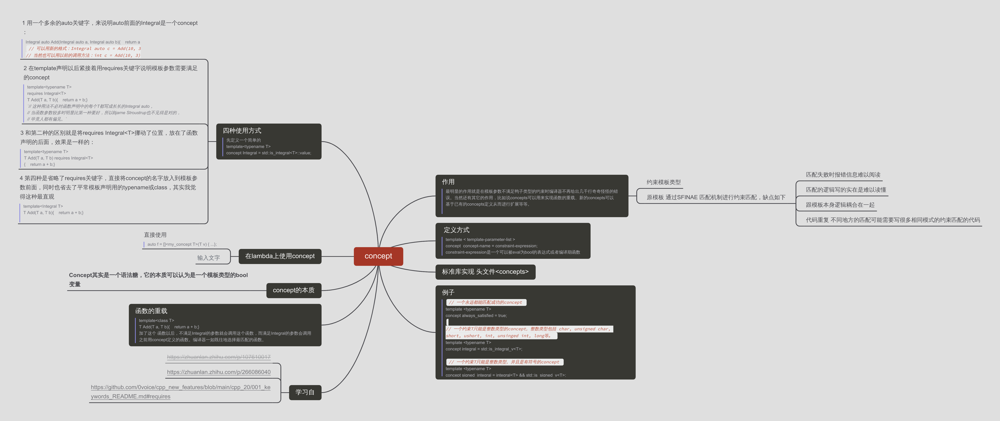

我写的文档



[C++20 Concepts - a Quick Introduction - C++ Stories](https://www.cppstories.com/2021/concepts-intro/)

1. 什么是concept

> In short, a concept is a set of constraints on template parameters evaluated at compile time. 

> A concept is a named set of requirements. The definition of a concept must appear at namespace scope. -cpprefrence

对`template`的参数提供一系列的`constraints`

concept 可以代码c++17的很SFINA,简化代码,增加代码可读性

cpprefrence 上concept的章节

- Constraints
  - Conjunctions
  - Disjunctions
  - Atomic constraints
  Constraint normalization
- Requires clauses
- Partial ordering of constraints

## c++ stories

```cpp
//a example of simple concept
//use one condition of type_traits
template <class T>
concept integral = std::is_integral_v<T>;


template <typename T>
concept ILabel = requires(T v) // use type T define parameter v
{
    {v.buildHtml()} -> std::convertible_to<std::string>;
    // v.buildHtml meaning that T object has member function called buildHtml()
    // which return somthing convertible to std::string.
};

```


### how to use

for template function

```cpp
template <typename T>
requires CONDITION // <-- there
void DoSomething(T param) { }


template <typename T>       //v-- or there
void DoSomething(T param) requires CONDITION
{ 
    
}
```


## requires-expressions

1. 语法
```cpp
1.不带参数
2.带参数
```

四种requirements

- simple requirement 简单的
- type requirements 类型相关的
  ```
  带有 typename 这个关键字,后面跟一个类型名
  - 检查一个nested type 是否存在
  - class template specialization 是否存在
  - an alias template specialization names
  ```
- compound requirements 复合型的
  ```plaintext
  { expression } noexcept(optional) return-type-requirement(optional) ;		
  return-type-requirement	-	-> type-constraint
  ```
  1. 有上面的形式
  1. Template arguments (if any) are substituted into expression;
  2. If noexcept is used, expression must not be potentially throwing;
  3. If return-type-requirement is present, then:
    - Template arguments are substituted into the return-type-requirement;
    - decltype((expression)) must satisfy the constraint imposed by the type-constraint. Otherwise, the enclosing requires-expression is false.
- nested requirements 嵌套的
  1. form
  ```
  requires constraint-expression ;		
  ```
  ```plaintext
  template<class T>
  concept Semiregular = DefaultConstructible<T> &&
    CopyConstructible<T> && Destructible<T> && CopyAssignable<T> &&
  requires(T a, size_t n)
  {  
      requires Same<T*, decltype(&a)>; // nested: "Same<...> evaluates to true"
      { a.~T() } noexcept; // compound: "a.~T()" is a valid expression that doesn't throw
      requires Same<T*, decltype(new T)>; // nested: "Same<...> evaluates to true"
      requires Same<T*, decltype(new T[n])>; // nested
      { delete new T }; // compound
      { delete new T[n] }; // compound
  };
  ```

- [Requires expression (since C++20) - cppreference.com](https://en.cppreference.com/w/cpp/language/requires)
- [Requires-expression | Andrzej's C++ blog](https://akrzemi1.wordpress.com/2020/01/29/requires-expression/)


## 重要的资料

- [Concepts library (C++20) - cppreference.com](https://en.cppreference.com/w/cpp/concepts)
