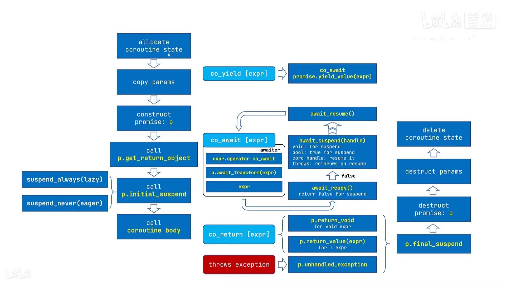

# coroutine 协程

## 哪些资源

- [My tutorial and take on C++20 coroutines](https://www.scs.stanford.edu/~dm/blog/c++-coroutines.html)
  - [我存的github地址](https://github.com/rbookr/cpp-hub/blob/master/cpp20/corountines/c%2B%2B-coroutines.pdf)
- 很好的视频教程 [C++ 20 的协程其实就是一首歌？-哔哩哔哩](https://b23.tv/wyaKYsL)
  - 对应的教案 https://www.bennyhuo.com/book/cpp-coroutines/00-foreword.html
- [Coroutines (C++20) - cppreference.com](https://en.cppreference.com/w/cpp/language/coroutines)

## what is a coroutine?

> A coroutine is a function that can suspend execution to be resumed later.

协程必须包含这个三个运算符 `co_await` `co_yield` `co_return` 一个或多个.

## 限制

协程不能使用变长实参，普通的 return 语句，或占位符返回类型（auto 或 Concept）。
constexpr 函数、构造函数、析构函数及 main 函数 不能是协程。

## Q: coroutine 有些组件与概念

- keywords / operator
  - co_await
  - co_return
  - co_yield
- concept 概念
  - promise object,承诺对象
    - 如果通过`std::coroutine_traits`根据协程的返回类型来得到`promise_type`
    - `promise object` 如何在`construct`
    - `promise object` 在heap的state上
    - `promise object` 内部的成员函数何时被调用
  - coroutine handle,协程句柄
    - 相当于一个指针
    - 如何得到句柄
    - 如何赋值?
  - coroutine state,协程状态
    - running
    - suspend
    - resumed
    - finish

### 1 Q which is promise object

```cpp{4}
//协程的返回对象
struct MyRet {
    //协程的返回对象,必须有 promise_type
    struct promise_type { //这个就是 promise object
        MyRet get_return_object()
        { 
          return {std::coroutine_handle<promise_type>::from_promise(*this)};
        }

        std::suspend_always initial_suspend() noexcept { return {}; }
        std::suspend_always final_suspend() noexcept { return {}; }
        void return_void() {}
        void unhandled_exception() {}
    };
};
```

如何理解,其实是理解它执行的过程

如果有一个协程如:`MyRet coro()`,当你第一次执行它时

> When a coroutine begins execution, it performs the following:
> 
> * allocates the coroutine state object using operator new (see below)
> * copies all function parameters to the coroutine state: by-value parameters are moved or copied, by-reference parameters remain references (and so may become dangling if the coroutine is resumed after the lifetime of referred object ends)
> * calls the constructor for the promise object. If the promise type has a constructor that takes all coroutine parameters, that constructor is called, with post-copy coroutine arguments. Otherwise the default constructor is called.
> * calls promise.get_return_object() and keeps the result in a local variable. The result of that call will be returned to the caller when the coroutine first suspends. Any exceptions thrown up to and including this step propagate back to the caller, not placed in the promise.
> * calls promise.initial_suspend() and co_awaits its result. Typical Promise types either return a suspend_always, for lazily-started coroutines, or suspend_never, for eagerly-started coroutines.
> * when co_await promise.initial_suspend() resumes, starts executing the body of the coroutine 
>
> When a coroutine reaches a suspension point
> * the return object obtained earlier is returned to the caller/resumer, after implicit conversion to the return type of the coroutine, if necessary.
> 
> When a coroutine reaches the co_return statement, it performs the following:
>
> * calls promise.return_void() for
>   * co_return;
>   * co_return expr where expr has type void
>   * falling off the end of a void-returning coroutine. The behavior is undefined if the Promise type has no Promise::return_void() member function in this case.
> * or calls promise.return_value(expr) for co_return expr where expr has non-void type
> * destroys all variables with automatic storage duration in reverse order they were created.
> * calls promise.final_suspend() and co_awaits the result.
>
> If the coroutine ends with an uncaught exception, it performs the following:
> 
> * catches the exception and calls promise.unhandled_exception() from within the catch-block
> * calls promise.final_suspend() and co_awaits the result (e.g. to resume a continuation or publish a result). It's undefined behavior to resume a coroutine from this point.
> 
> When the coroutine state is destroyed either because it terminated via co_return or uncaught exception, or because it was destroyed via its handle, it does the following:
> 
> - calls the destructor of the promise object.
> - calls the destructors of the function parameter copies.
> - calls operator delete to free the memory used by the coroutine state
> - transfers execution back to the caller/resumer.

## Q: 它们如何配合/组合



## 实例代码


## 协程的执行过程是怎样的 coroutine is a function that can suspend execution to be resumed later.

协程与以下对象关联

- promise object
- coroutine_handle
- coroutine state
  - promise obeject
  - arguments (all copied by value)
  - stop point,使得恢复时程序知晓要从何处继续，销毁时知晓有哪些局部变量在作用域内
  - 生存期跨过当前暂停点的局部变量和临时量


## what is promise Object

responsibilites of coroutine-Promise;
 - return_void()/return_value()/yield_value()
 - unhandle_exception()

- c++20 的 coroutine 是给库的开发者使用的，所以看起来比较复杂
- c++20 的 coroutine 标签只包含编译器需要实现的底层功能，并没有简单方便的高级库

## awaitable

```cpp
```


promise object
coroutine handle
coroutine state


concept
- awaitable , awaiter

new lanauge keywords

- co_await
- co_yield
- co_return

new types

- `coroutine_handle<P>`
- `coroutine_traits<Ts...>`
- suspend_always
- suspend_never

general mechanism
facility

Two kinds of interfaces that are defined by the coroutines

- Promise
- Awaitable

## co_await 执行过程

1. `co_await` is a unary operator.
2. effect: suspend coroutine and return control to the caller.
3. expr define `operator co_await`

```cpp
co_await expr
```

`expr`通常是一个`awaiter`对象,叫做等待器

写法如下:

```cpp
struct MyAwaiter {
  bool await_ready(){
    return false; //--> 暂停-->await_suspend
  }

  void await_suspend(std::coroutine_handle<> h);
  bool await_suspend();
  coroutine_handle await_suspend();
  //throws: rethrows on resume

  //它的结果 就是整个co_await expr 的结果
  //它在恢复的时候被执行
  void await_resume()
  int await_resume()
};
```

简易的执行过程如下,具体的看这里 https://en.cppreference.com/w/cpp/language/coroutines#co_await

await_ready 返回 bool 类型，如果返回 true，则表示已经就绪，无需挂起；否则表示需要挂起。


await_ready 返回 false 时，协程就挂起了。这时候协程的局部变量和挂起点都会被存入协程的状态当中，await_suspend 被调用到。

```cpp
??? await_suspend(std::coroutine_handle<> coroutine_handle);
```

参数 coroutine_handle 用来表示当前协程，我们可以在稍后合适的时机通过调用 resume 来恢复执行当前协程：

```cpp
coroutine_handle.resume();
```

注意到 await_suspend 函数的返回值类型我们没有明确给出，因为它有以下几种选项：

*   返回 void 类型或者返回 true，表示当前协程挂起之后将执行权还给当初调用或者恢复当前协程的函数。
*   返回 false，则恢复执行当前协程。注意此时不同于 await_ready 返回 true 的情形，此时协程已经挂起，await_suspend 返回 false 相当于挂起又立即恢复。
*   返回其他协程的 coroutine_handle 对象，这时候返回的 coroutine_handle 对应的协程被恢复执行。
*   抛出异常，此时当前协程恢复执行，并在当前协程当中抛出异常。

可见，await_suspend 支持的情况非常多，也相对复杂。实际上这也是 C++ 协程当中最为核心的函数之一了。

### [#](#await-resume) await_resume

协程恢复执行之后，等待体的 await_resume 函数被调用。

    ??? await_resume()；

1  

同样地，await_resume 的返回值类型也是不限定的，返回值将作为 `co_await` 表达式的返回值。


## `co_yield` 执行过程

`co_yield`会返回一个值然后挂起协程.

等价于

```cpp
co_await promise.yield_value(expr)
```

也就是说它 其它是调用了`promise object`的`yield_value` 函数

```
std::suspend_always yield_value(int a){
  // save into promise object
  return {};
}
```

所以它的具体执行的过程应该去看`co_await`,只不过`co_yield`把结果传给了`promise.yield_value`
整个执行的过程应该分成了四个大的过程


### 1. convert to awaitable

1. 就是`expr`本身(简化了,具体看cppreference上原文)
2. 当前的`promise_type`有一个成员函数`await_transform`,那么`awaitable`就是`promise.await_transform(expr)`

### 2. get awaiter

1. the awaiter is `operator co_await()`
2. 自己本身

### 3. call `awaiter.await_ready()`

1. 调用 `awaiter.await_ready()`
2. 根据结果来决定是否暂停
3. `false`
  - 暂停协程
  - 调用`awaiter.await_suspend(handle)`
    - 如果`await_suspend`返回`void`,此协程保持暂停,返回控制给调用方
    - 如果`await_suspend`返回`bool`,
      - 值为`true`,此协程保持暂停,返回控制给调用方
      - 值为`false`,恢复此协程
    - 如果`await_suspend`返回其它协程`other_hanle`,调用`other_hanle.resume()`,恢复该协程（注意这可以连锁进行，并最终导致当前协程恢复）
    - 如果 `await_suspend` 抛出异常，那么捕捉该异常，恢复协程，并立即重抛异常
  - 最后，调用 `awaiter.await_resume()`，它的结果就是整个 `co_await expr` 表达式的结果

### 4. call `awaiter.await_resume()`

一个疑问,协程A调用协程B,如果B暂停,那么A暂停,否则A不暂停,怎么实现呢?

```
A        ->        B
handle A -> handle B

co_await function B()  -> bool
```

## 我写的代码

### 最基础的协程

一个最基础的协程,可以暂停,启动.通过这个代码了解协程的结构

```cpp
<%- include("mycode/base1.cpp") _%>
```

- `co_await`的使用 <toGitLink file="mycode/base2.cpp" />

## 参考

- 很好的视频教程 [C++ 20 的协程其实就是一首歌？-哔哩哔哩](https://b23.tv/wyaKYsL)
  - 对应的教案 https://www.bennyhuo.com/book/cpp-coroutines/00-foreword.html
- [c++20协程入门 - 知乎](https://zhuanlan.zhihu.com/p/59178345)
- [C++网络编程之asio(五)——在asio中使用协程 - 知乎](https://zhuanlan.zhihu.com/p/58784652)
- [C++ Coroutines: Understanding operator co_await | Asymmetric Transfer](https://lewissbaker.github.io/2017/11/17/understanding-operator-co-await)
- 看这个能看懂 [Pavel Novikov - "Understanding Coroutines by Example" - C++ London - YouTube](https://www.youtube.com/watch?v=7sKUAyWXNHA)
- [Andreas Buhr: C++ Coroutines - YouTube](https://www.youtube.com/watch?v=vzC2iRfO_H8)
- an awaitable which suspends every second time [Painless C++ Coroutines -Part 1. Learn how to cretae a simple coroutine | by Gajendra Gulgulia | May, 2021 | Medium | Nerd For Tech](https://medium.com/nerd-for-tech/painless-c-coroutines-part-1-ba90dd101adb)
