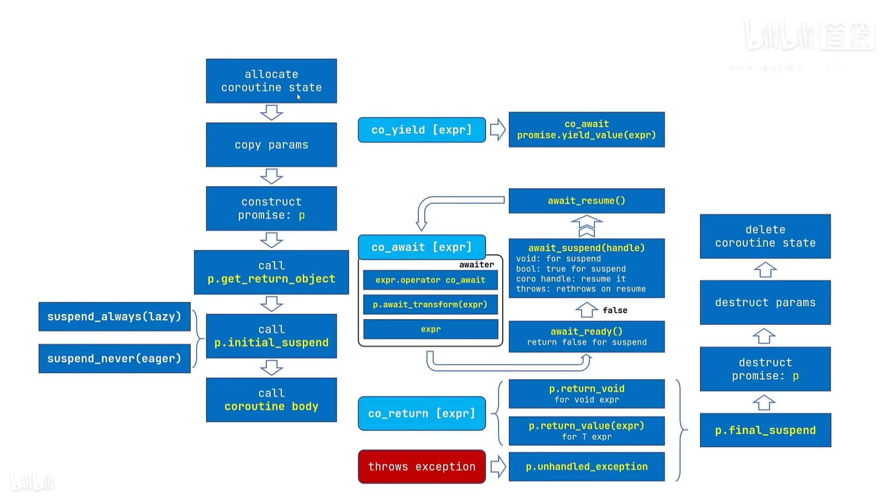

# coroutine 协程

## what is a coroutine?

> A coroutine is a function that can suspend execution to be resumed later.

协程必须包含这个三个运算符 `co_await` `co_yield` `co_return` 一个或多个.

## 限制

协程不能使用变长实参，普通的 return 语句，或占位符返回类型（auto 或 Concept）。
constexpr 函数、构造函数、析构函数及 main 函数 不能是协程。


## 协程的执行过程是怎样的 coroutine is a function that can suspend execution to be resumed later.


协程与以下对象关联

- promise object
- coroutine_handle
- coroutine state
  - promise obeject
  - arguments (all copied by value)
  - stop point,使得恢复时程序知晓要从何处继续，销毁时知晓有哪些局部变量在作用域内
  - 生存期跨过当前暂停点的局部变量和临时量





## what is promise Object

responsibilites of coroutine-Promise;
 - return_void()/return_value()/yield_value()
 - unhandle_exception()

- c++20 的 coroutine 是给库的开发者使用的，所以看起来比较复杂
- c++20 的 coroutine 标签只包含编译器需要实现的底层功能，并没有简单方便的高级库

## awaitable

```cpp


```


promise object
coroutine handle
coroutine state


concept
- awaitable , awaiter

new lanauge keywords

- co_await
- co_yield
- co_return

new types

- `coroutine_handle<P>`
- `coroutine_traits<Ts...>`
- suspend_always
- suspend_never

general mechanism
facility

Two kinds of interfaces that are defined by the coroutines

- Promise
- Awaitable

## co_await 执行过程

1. `co_await` is a unary operator.
2. effect: suspend coroutine and return control to the caller.
3. expr define `operator co_await`

```cpp
co_await expr
```

## co_yield 执行过程

`co_yield`会返回一个值然后挂起协程.

等价于

```cpp
co_await promise.yield_value(expr)
```

所以它的具体执行的过程应该去看`co_await`,只不过`co_yield`把结果传给了`promise.yield_value`

事个执行的过程应该分成了四个大的过程

### 1. convert to awaitable

1. 就是`expr`本身(简化了,具体看cppreference上原文)
2. 当前的`promise_type`有一个成员函数`await_transform`,那么`awaitable`就是`promise.await_transform(expr)`

### 2. get awaiter

### 3. call `awaiter.await_ready()`

### 4. call `awaiter.await_resume()`


- [C++ Coroutines: Understanding operator co_await | Asymmetric Transfer](https://lewissbaker.github.io/2017/11/17/understanding-operator-co-await)

  看这个能看懂
- [Pavel Novikov - "Understanding Coroutines by Example" - C++ London - YouTube](https://www.youtube.com/watch?v=7sKUAyWXNHA)

[Andreas Buhr: C++ Coroutines - YouTube](https://www.youtube.com/watch?v=vzC2iRfO_H8)

lewissbaker.github.io
youtu.be/8C8NnE1Dg4A

eel.is/c++draft/dcl.fct.def.coroutine

an awaitable which suspends every second time
[Painless C++ Coroutines -Part 1. Learn how to cretae a simple coroutine | by Gajendra Gulgulia | May, 2021 | Medium | Nerd For Tech](https://medium.com/nerd-for-tech/painless-c-coroutines-part-1-ba90dd101adb)

## 参考

- 很好的视频教程 [C++ 20 的协程其实就是一首歌？-哔哩哔哩](https://b23.tv/wyaKYsL)
  - 对应的教案 https://www.bennyhuo.com/book/cpp-coroutines/00-foreword.html
- [c++20协程入门 - 知乎](https://zhuanlan.zhihu.com/p/59178345)
- [C++网络编程之asio(五)——在asio中使用协程 - 知乎](https://zhuanlan.zhihu.com/p/58784652)

